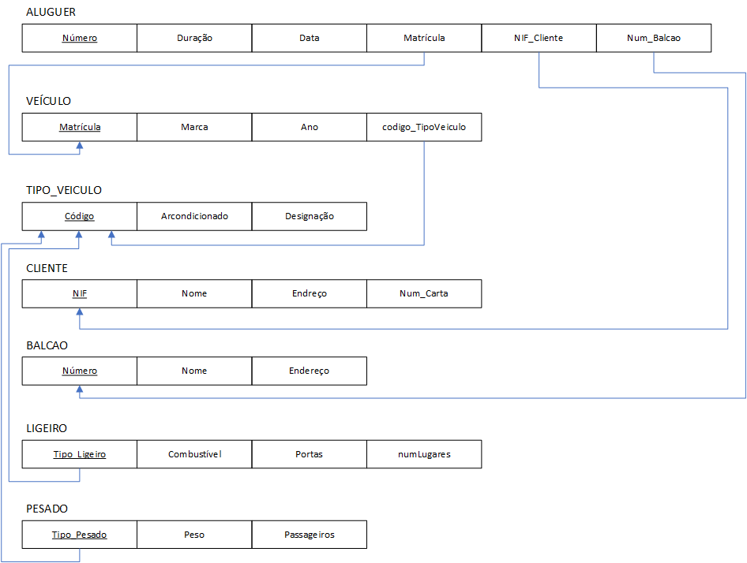
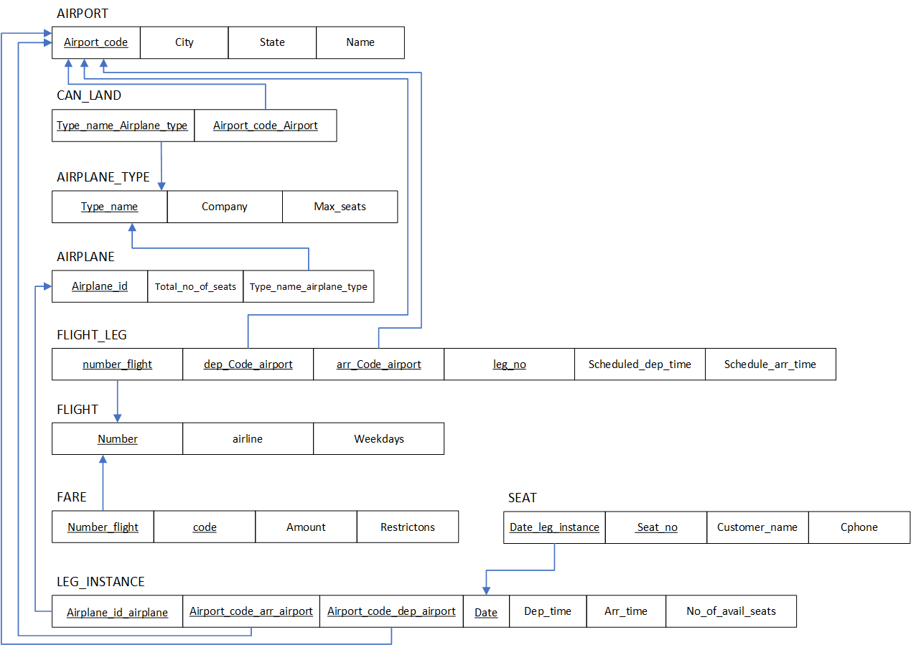
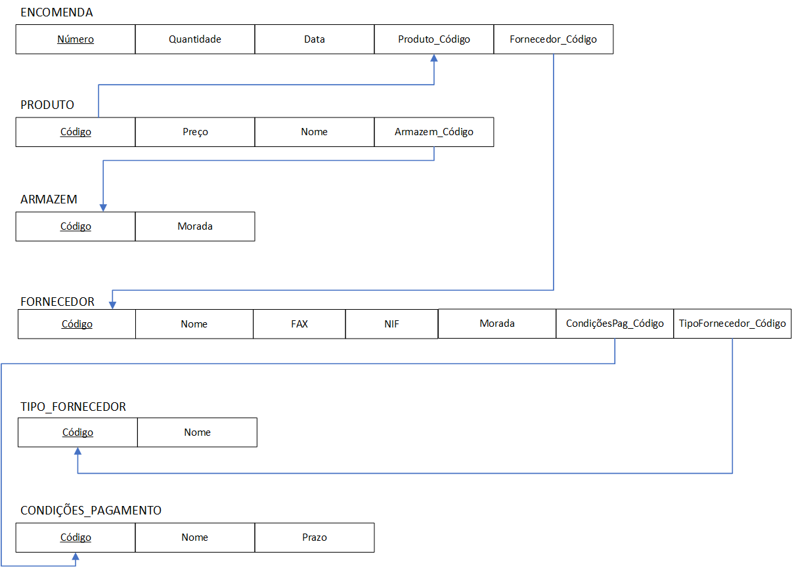
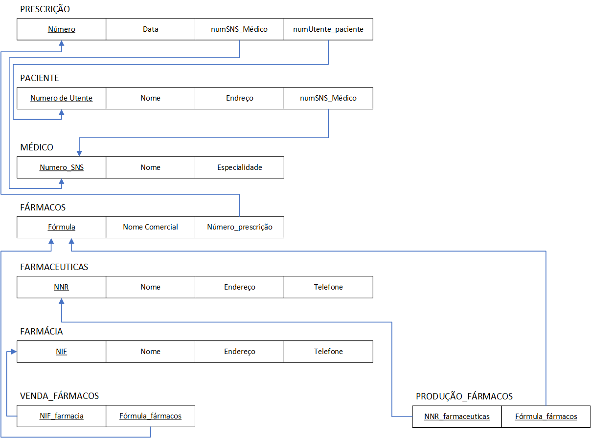
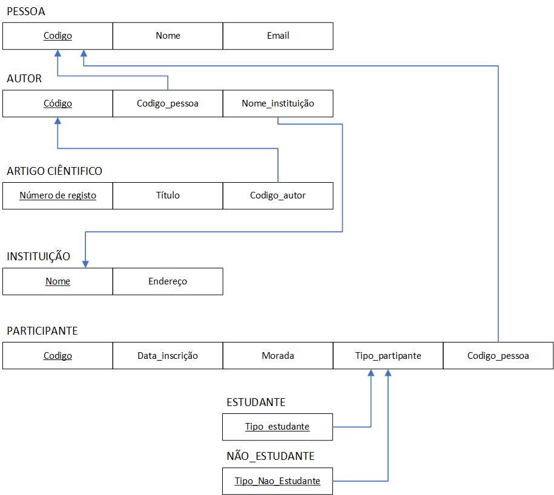
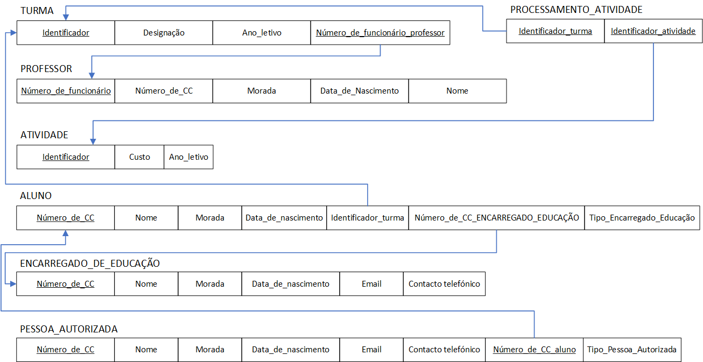

# BD: Guião 3


## ​Problema 3.1
 
### *a)*
```
cliente(NIF, nome, endreco, num_carta)
balcao(número,nome,endereco)
aluguer(número, duracao, data, matricula, NIF_cliente, número_balcao, matricula_veiculo)
veiculo(matrícula, marca, ano, codigo_tipoveiculo)
tipo_veiculo_(codigo, arcondicionado, designacao)
ligeiro(tipo_ligiero, combustivel, portas, numlugares, codigo_tipoVeiculo)
pesado(tipo_pessado, peso, passageiros, codigo_tipoVeiculo)
```


### *b)* 

```
cliente: NIF, nome, endreco, num_carta
PK: NIF
CK(s): NIF, num_carta
FK(s): (none)

balcao: número, nome, endereco
PK: número
CK(s): nome, número
FK(s): (none)

aluguer: número, duracao, data, matricula, NIF_cliente, número_balcao, matricula_veiculo
PK: número
CK(s): número, matricula
FK(s): NIF_cliente, número_balcao, matricula_veiculo

veiculo: matrícula, marca, ano, codigo_tipoveiculo
PK: matricula
CK(s): marca, matricula
FK(s): codigo_tipoveiculo

tipo_veiculo: codigo, arcondicionado, designacao
PK: codigo
CK(s): codigo, designacao
FK(s): none

ligeiro: tipo_ligiero, combustivel, portas, numlugares, codigo_tipoVeiculo
PK: tipo_ligiero
CK(s): tipo_ligiero
FK(s): codigo_tipoVeiculo

pesado: tipo_pessado, peso, passageiros, codigo_tipoVeiculo
PK: tipo_pessado
CK(s): tipo_pessado
FK(s): codigo_tipoVeiculo
```


### *c)* 




## ​Problema 3.2

### *a)*

```
airport(Airport_code, City, State, Name)
can_land(Type_name_Airplane_type, Airport_code_airport)
airplane_type(Type_name, Company, Max_seats)
airplane(Airplane_id, Total_no_of_seats, Type_name_airplane_type)
flight_leg(dep_Code_airport, arr_Code_airport, number_flight, leg_no, Scheduled_dep_time, Schedule_arr_time)
flight(Number, Airline, Weekdays)
fare(Number_flight, Code, Amount, Restrictons)
leg_instance(Airplane_id_airplane, Airport_code_arr_airport, Airport_code_dep_airport, Date, Dep_time, Arr_time, No_of_avail_seats)
seat(Seat_no, cena da entidade fraca)
```


### *b)* 

```
airport: Airport_code, City, State, Name
PK: Airport_code
CK(s): Airport_code, Name
FK(s): none

can_land: Type_name_Airplane_type, Airport_code_airport
PK: Type_name_Airplane_type, Airport_code_airport
CK(s): none
FK(s): Type_name_Airplane_type, Airport_code_airport


airplane_type: Type_name, Company, Max_seats
PK: Type_name
CK(s): Type_name, Max_seats
FK(s): none

airplane: Airplane_id, Total_no_of_seats, Type_name_airplane_type
PK: Airplane_id
CK(s): Type_name, Total_no_of_seats
FK(s): Type_name_airplane_type

flight_leg: dep_Code_airport, arr_Code_airport, number_flight, leg_no, Scheduled_dep_time, Schedule_arr_time
PK: number_flight, dep_Code_airport, arr_Code_airport, leg_no
CK(s): leg_no, Scheduled_dep_time, Schedule_arr_time
FK(s): dep_Code_airport, arr_Code_airport, number_flight

flight: Number, airline, Weekdays 
PK: Number
CK(s): Number, airline
FK(s): none

fare: Number_flight, Code, Amount, Restrictons
PK: Number_flight, code
CK(s): Code, Amount
FK(s): Number_flight

leg_instance: Airplane_id_airplane, Airport_code_arr_airport, Airport_code_dep_airport, Date, Dep_time, Arr_time, No_of_avail_seats
PK: Airplane_id_airplane, Airport_code_arr_airport, Airport_code_dep_airport, Date
CK(s): Date, No_of_avail_seats
FK(s): Airplane_id_airplane, Airport_code_arr_airport, Airport_code_dep_airport

seat: Date_leg_insrance, Seat_no, Customer_name, Cphone
PK: Date_leg_instance, Seat_no
CK(s): Seat_no, Customer_name
FK(s): Date_leg_instance
``` 


### *c)* 




## ​Problema 3.3


### *a)* 2.1



### *b)* 2.2



### *c)* 2.3



### *d)* 2.4

